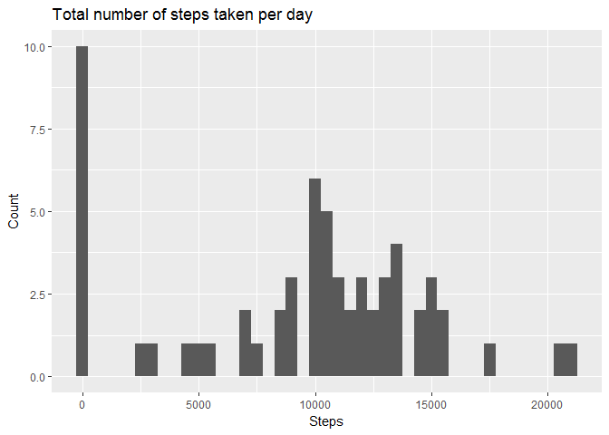
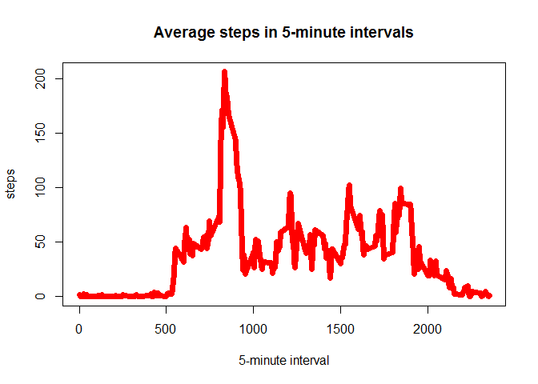

# Reproducible Research: Peer Assessment 1


## Loading and preprocessing the data


```r
data <- read.csv("activity.csv")
data[,"date"] <- as.Date(data$date,format = "%Y-%m-%d")
```

## What is mean total number of steps taken per day?
#### 1. Histogram of the total number of steps taken each day  


```r
data_step_day<-aggregate(list(steps = data$steps),by=list(date = data$date),FUN=sum,na.rm=TRUE)
library(ggplot2)
p <- ggplot(data_step_day, aes(steps))
p + geom_histogram(binwidth = 500) + labs(title = "Total number of steps taken per day",x = "Steps", y = "Count")
```

<!-- -->

#### 2. The mean and median total number of steps taken per day


```r
mean_total_steps <- mean(data_step_day$steps)
mean_total_steps
```

```
## [1] 9354.23
```

```r
median_total_steps <- median(data_step_day$steps)
median_total_steps
```

```
## [1] 10395
```

## What is the average daily activity pattern?
### Time series plot (i.e. type = "l") of the 5-minute interval (x-axis) and the average number of steps taken, averaged across all days (y-axis)


```r
avg_step_interval<-aggregate(list(steps = data$steps),by=list(interval = data$interval),FUN=mean,na.rm=TRUE)
plot(avg_step_interval, type = "l", col = "red", xlab = "5-minute interval", main = "Average steps in 5-minute intervals")
```

<!-- -->


```r
maxi <- avg_step_interval[which.max(avg_step_interval$steps),]
```

#### The maximum number of steps: 206.1698113
#### 5 - minute interval what contains that: 835

## Imputing missing values

### The total number of rows with NAs: 


```r
na_values <- sum(is.na(data))
na_values
```

```
## [1] 2304
```

### Strategy for filling in all of the missing values in the dataset. I use the mean for that 5-minute interval.

```r
corr_data <- data
for (i in 1:nrow(data)){
        if (is.na(data[i,"steps"])){
                corr_data[i,"steps"] <- avg_step_interval[which(avg_step_interval$interval == data[i,"interval"]),2]
        }
}
```
## Are there differences in activity patterns between weekdays and weekends?
