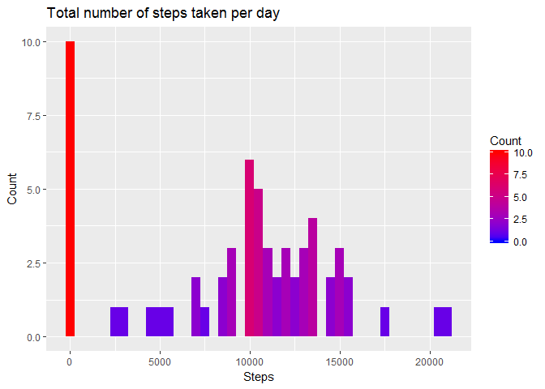
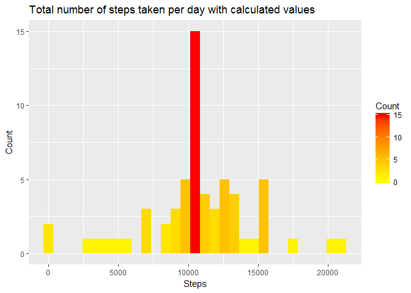
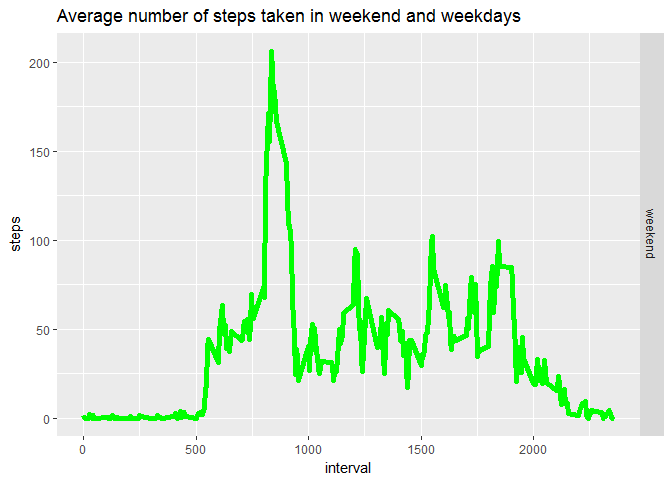

# Reproducible Research: Peer Assessment 1


## Loading and preprocessing the data


```r
data <- read.csv("activity.csv")
data[,"date"] <- as.Date(data$date,format = "%Y-%m-%d")
```

## What is mean total number of steps taken per day?
#### 1. Histogram of the total number of steps taken each day  


```r
data_step_day<-aggregate(list(steps = data$steps),by=list(date = data$date),FUN=sum,na.rm=TRUE)
library(ggplot2)
p <- ggplot(data_step_day, aes(steps))
p + geom_histogram(binwidth = 500,aes(fill = ..count..)) + labs(title = "Total number of steps taken per day",x = "Steps", y = "Count") + scale_fill_gradient("Count", low = "blue", high = "red")
```

<!-- -->

#### 2. The mean and median total number of steps taken per day


```r
mean_total_steps <- mean(data_step_day$steps)
median_total_steps <- median(data_step_day$steps)
```
### Mean: 9354.2295082
### Median: 10395

## What is the average daily activity pattern?
### Time series plot (i.e. type = "l") of the 5-minute interval (x-axis) and the average number of steps taken, averaged across all days (y-axis)


```r
avg_step_interval<-aggregate(list(steps = data$steps),by=list(interval = data$interval),FUN=mean,na.rm=TRUE)
plot(avg_step_interval, type = "l", col = "red", xlab = "5-minute interval", main = "Average steps in 5-minute intervals", lwd = 7)
```

<!-- -->


```r
maxi <- avg_step_interval[which.max(avg_step_interval$steps),]
```

#### The maximum number of steps: 206.1698113
#### 5 - minute interval what contains that: 835

## Imputing missing values

#### The total number of rows with NAs: 


```r
na_values <- sum(is.na(data))
na_values
```

```
## [1] 2304
```

#### Strategy for filling in all of the missing values in the dataset. I use the mean for that 5-minute interval. The new dataset's name is corr_data what is equal to the original dataset but with the missing data filled in.

```r
corr_data <- data
for (i in 1:nrow(data)){
        if (is.na(data[i,"steps"])){
                corr_data[i,"steps"] <- avg_step_interval[which(avg_step_interval$interval == data[i,"interval"]),2]
        }
}
```

#### Histogram of the total number of steps taken each day with calculated values.


```r
corr_data_step_day<-aggregate(list(steps = corr_data$steps),by=list(date = corr_data$date),FUN=sum,na.rm=TRUE)
p <- ggplot(corr_data_step_day, aes(steps))
p + geom_histogram(binwidth = 700,aes(fill = ..count..)) + labs(title = "Total number of steps taken per day with calculated values",x = "Steps", y = "Count") + scale_fill_gradient("Count", low = "yellow", high = "red")
```

<!-- -->

#### The dataset mean:

```r
mean(corr_data_step_day$steps)
```

```
## [1] 10766.19
```

#### The dataset median:

```r
median(corr_data_step_day$steps)
```

```
## [1] 10766.19
```
## Are there differences in activity patterns between weekdays and weekends?

#### Create a new factor variable in the dataset with two levels – “weekday” and “weekend” indicating whether a given date is a weekday or weekend day. 

```r
weekdays1 <- c("Monday", "Tuesday", "Wednesday", "Thursday", "Friday")
w_data <- data.frame(steps = corr_data$steps,interval = corr_data$interval, week = factor((weekdays(corr_data$date) %in% weekdays1), levels=c(FALSE, TRUE), labels=c("weekend", "weekday")) )
```

#### Panel plot containing a time series plot (i.e. type = "l") of the 5-minute interval (x-axis) and the average number of steps taken, averaged across all weekday days or weekend days (y-axis).


```r
avg_step_interval_weekdays<-aggregate(list(steps = w_data$steps),by=list(week = w_data$week, interval = w_data$interval),FUN=mean,na.rm=TRUE)
p <- ggplot(avg_step_interval_weekdays,aes(interval,steps)) + geom_line(color = "green",size=2)
p + facet_grid(week~.) + labs(title = "Average number of steps taken in weekend and weekdays")
```

<!-- -->

#### End of the assignment.
